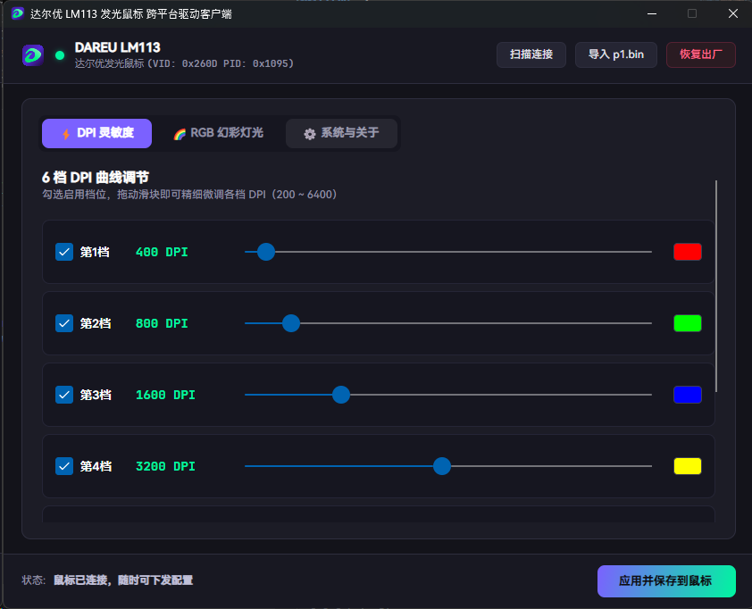
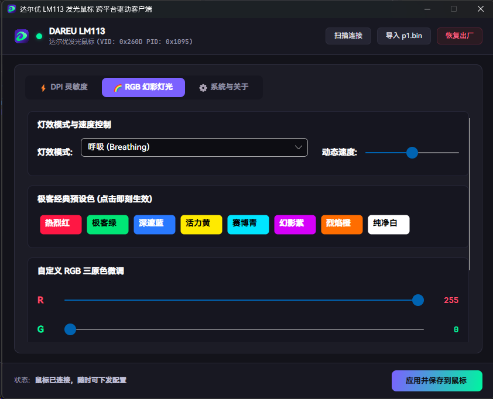
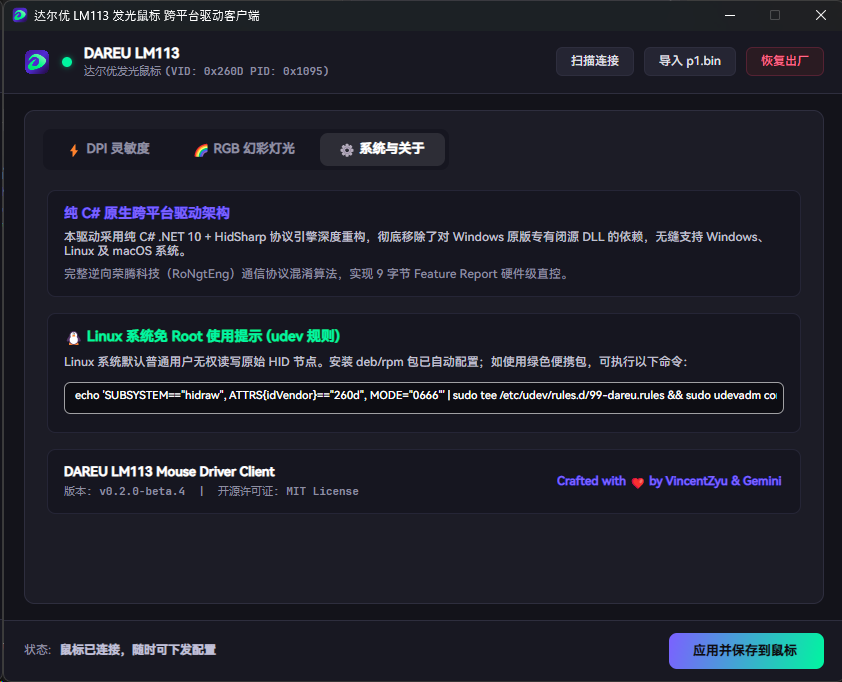
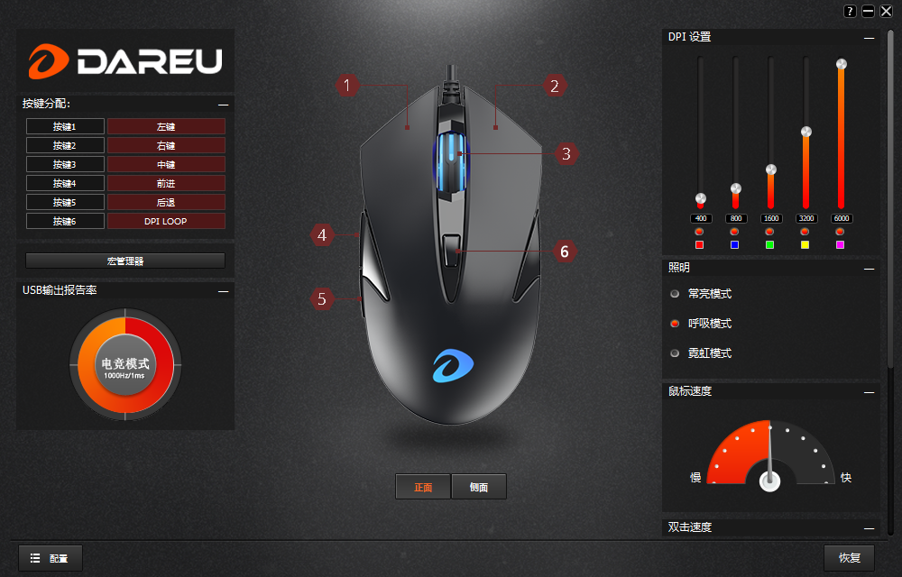
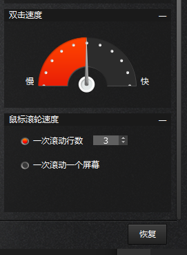

<div align="center">


# DAREU LM113 达尔优发光鼠标 跨平台驱动客户端

[](https://github.com/VincentZyu233/DAREU-LM113-MOUSE-DRIVER-CLIENT/actions/workflows/release.yml)
[](https://github.com/VincentZyu233/DAREU-LM113-MOUSE-DRIVER-CLIENT/releases)
[](LICENSE)

基于 **C# .NET 10** 与 **Avalonia 11** 构建的达尔优 LM113 发光鼠标（兼容荣腾 / 盛群 Holtek / 中颖方案）跨平台免驱配置工具。原生支持 **Windows**、**Linux** 与 **macOS**。

</div>

---

## 📸 界面预览 (Screenshots)

### 🌟 全新跨平台现代控制中心 (Avalonia 11)

| ⚡ DPI 灵敏度与回报率调节 | 🎨 RGB 炫彩灯效控制 |
|:---:|:---:|
|  |  |

<div align="center">

**⚙️ 设备系统信息与关于**



</div>

---

## 💡 开发背景与初衷

> 起因是购买这款达尔优 LM113 游戏发光鼠标后，咨询京东官方客服获取到的驱动程序仅支持 Windows 平台。然而作为一名日常重度使用 Linux 桌面的开发者，在 Linux 环境下无法调优鼠标回报率、自由配置多档 DPI 与 RGB 炫彩灯效。
>
> 为此，通过逆向分析原版 Windows 驱动，成功破译了底层的 USB HID 协议与荣腾（Rongteng）方案的对称混淆加密算法（密钥 `RoNgtEng`），并基于 **C# .NET 10** 与 **Avalonia 11** 从零打造了这款真正跨平台（Linux / Windows / macOS 通用）的现代化桌面客户端，让所有桌面平台用户都能享受完整自由的硬件配置体验！

<details open>
<summary><b>🔍 原厂官方 Windows 驱动程序参考界面（点击可收起）</b></summary>
<br />

| 原厂驱动首页参数配置 | 原厂驱动右下角隐藏高级设置 |
|:---:|:---:|
|  |  |

</details>

---

## ✨ 特性一览

- 🚀 **真正跨平台与免驱动**：使用纯系统原生 HID 通信（Windows `hid.dll`、Linux `/dev/hidraw*`、macOS `IOKit`），无额外第三方 C 库依赖。
- 🎨 **现代桌面 GUI**：基于 Avalonia 11 Fluent 现代深色主题设计，界面清爽，直观操作。
- ⚡ **DPI 灵敏度自定义**：支持 1~6 档独立 DPI 自定义（250 ~ 6000 DPI）、多段开关及 USB 报告率调节（1000Hz/500Hz/250Hz/125Hz）。
- 🌈 **RGB 炫彩灯效控制**：常亮、呼吸、霓虹、指动模式调节，具备快速预设色盘与 RGB 分量自由调节，内置硬件 RBG 引脚排布校准。
- 🔄 **向下兼容原版**：内置解析引擎，一键无损导入原版官方驱动的 `p1.bin` 配置文件。
- 📦 **自动化 Release**：由 GitHub Actions 矩阵全自动编译发布 Windows (单文件免安装 EXE)、Linux (deb, rpm, tar.gz) 与 macOS 产物。

---

## 🖥️ 快速运行与编译

### 运行 Avalonia GUI 桌面应用
```bash
dotnet run --project src/Dareu.LM113.App
```

### 运行 CLI 诊断与硬件测试工具
```bash
# 查看设备连接状态
dotnet run --project src/Dareu.LM113.Cli

# 触发实机彩虹流水灯变换
dotnet run --project src/Dareu.LM113.Cli -- --test-rgb

# 从原版驱动导入 p1.bin
dotnet run --project src/Dareu.LM113.Cli -- --import-p1
```

---

## 📦 各主流平台安装包指南

### 🪟 Windows
- **MSI 安装包（推荐）**：下载 `Dareu-LM113-win-x64.msi` 或 `Dareu-LM113-win-arm64.msi`，双击一步安装，**原生支持版本覆盖安装与升级**，并在开始菜单生成快捷方式。
- **绿色免安装包**：下载 `Dareu-LM113-win-x64.zip`，解压即跑。

### 🍎 macOS
- **DMG 镜像（推荐）**：下载 `Dareu-LM113-osx-arm64.dmg`（Apple Silicon M 系列）或 `Dareu-LM113-osx-x64.dmg`（Intel），双击打开并将“达尔优 LM113”直接拖入 `Applications` 应用程序文件夹。
- **便携归档**：下载 `Dareu-LM113-osx-*.tar.gz`。

### 🐧 Linux
- **DEB / RPM 安装包（推荐）**：
  ```bash
  # Ubuntu / Debian
  sudo dpkg -i dareu-lm113_*.deb

  # Fedora / RHEL
  sudo rpm -ivh dareu-lm113-*.rpm
  ```
  安装包会自动配置 `/etc/udev/rules.d/99-dareu-mouse.rules`、系统菜单快捷方式及图标。
- **手动权限配置 (使用绿色 tar.gz 时)**：
  ```bash
  sudo cp linux/99-dareu-mouse.rules /etc/udev/rules.d/
  sudo udevadm control --reload-rules && sudo udevadm trigger
  ```

---

## ⚙️ CI 触发约定 (Commit Keywords)

参考自标准工程约定，在 Git Commit 消息末尾附带关键词可控制 GitHub Actions 自动化构建行为：

| 🔑 关键词 | 📦 产物说明 | 🚀 发布 Release |
|---|---|:---:|
| `[build-artifact]` | 构建全部平台（Windows / Linux / macOS）产物，上传为 7 天 Artifact 供测试 | 否 |
| `[build-release]` | 超集：构建全平台产物 + 自动打 Tag + 创建正式 GitHub Release 挂载全部安装包 | **是** |

### 🤝 协作者署名规范 (Co-authorship)

本项目遵循标准 GitHub 协同规范，凡由 AI 辅助完成的代码与文档提交，均在 Commit 信息末尾附带标准协作者签名：
```text
Co-authored-by: gemini-code-assist <200291788+gemini-code-assist@users.noreply.github.com>
```

---

## 📄 开源许可证

本项目基于 [MIT 许可证](LICENSE) 开源。
